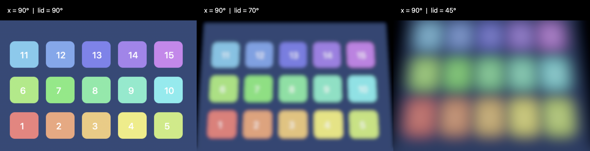
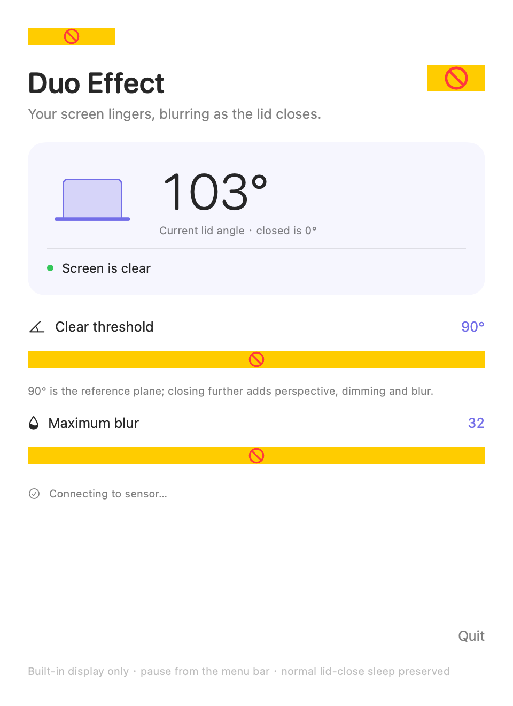

<div align="center">

# Duo Effect

**Your screen lingers, blurring as the lid closes.**



Duo Effect reads your MacBook's real lid angle and tilts, dims and blurs the
built-in display as you close it, with controls in the menu bar.

*[中文说明](README.zh-CN.md)*

</div>

<hr>

- **Real lid angle:** Reads the hinge sensor built into Apple Silicon MacBooks, so the effect follows your hand as you close the lid.
- **Live screen content:** Captures the built-in display with ScreenCaptureKit and re-renders it on the GPU with Metal at native Retina resolution and 60 fps.
- **Adjustable:** Pick the angle where the effect begins and how strong the blur gets. English and 简体中文 interface, switchable in the app.
- **Stays out of your way:** Clicks pass straight through to your apps, external displays are untouched, and normal lid-close sleep is preserved.

> [!NOTE]
> Nothing is recorded to disk, no audio is captured, and nothing goes over the network. Screen frames stay in memory only while the effect is active.

## Download

No prebuilt download yet. Build it yourself with the steps below; a release will be linked here once one is published.

Requires macOS 14 or later and an Apple Silicon MacBook with a lid angle sensor.
The app shows live sensor status, so you will know right away if your machine is supported.

## Getting started

1. Open **Duo Effect**. The settings window appears and the menu bar shows the live lid angle.
2. Click **Grant Screen Recording…** and allow **Duo Effect** in System Settings. This is what lets the app blur what is on screen.
3. If macOS asks you to reopen the app, quit it and open it again.
4. Slowly close the lid. Below the **Clear threshold** (90° by default) the picture tilts, dims and blurs; open the lid back past the threshold and it snaps back to normal.

Use the menu bar icon to pause, quit, or turn on debug logging. Settings are saved automatically.



## Build

Requires Xcode (or the Apple Swift toolchain) and an **Apple Development** or **Developer ID** signing certificate in your keychain. No third-party packages.

```sh
./scripts/build.sh
```

This produces `dist/Duo Effect.app`. Open it from Finder. If you have more than one signing certificate, set `CODE_SIGN_IDENTITY` to the certificate's SHA-1 first. Quit any running copy before rebuilding.

The build deliberately refuses ad-hoc signing: macOS ties the Screen Recording permission to the signing certificate, and an ad-hoc signature would make you re-grant it after every rebuild.

For tests, benchmarks, debug logging and the details of the effect model, see [docs/DEVELOPMENT.md](docs/DEVELOPMENT.md).

## Known limitations

- Only MacBooks with a readable lid angle sensor can use the effect. Verified on an M1 Pro MacBook Pro; the app reports when no sensor is found.
- The effect applies only to the built-in display, menu bar included.
- The effect is removed when the Mac sleeps, the screen locks, or the sensor or screen capture becomes unavailable.
- Protected video (DRM) may not be capturable by the system and can appear black under the effect.
- The lid angle protocol is not documented by Apple, so a future macOS release could break it.
- This is a visual effect, not a privacy screen or a security boundary.

## Troubleshooting

**The effect never starts after granting permission.** An older build may have left a stale permission record. Quit the app, reset only this app's record, then reopen and grant once more:

```sh
tccutil reset ScreenCapture local.ruixiang.macbookduo
```

**Something else went wrong.** Turn on **Start Debug Logging** in the menu bar and check `~/Library/Logs/Duo Effect/debug.log`.

## Acknowledgements

- [LidAngleSensor](https://github.com/samhenrigold/LidAngleSensor) for the lid angle sensor protocol information.
- Apple's [ScreenCaptureKit](https://developer.apple.com/documentation/screencapturekit) for local screen capture.

This project is built with AI assistance. The code is an independent implementation; no external code or packages are vendored.

## License

[MIT](LICENSE). The app is not sandboxed: beyond the Screen Recording grant it runs with your user's full file access and talks to IOKit directly, which is what reading the lid angle requires.
