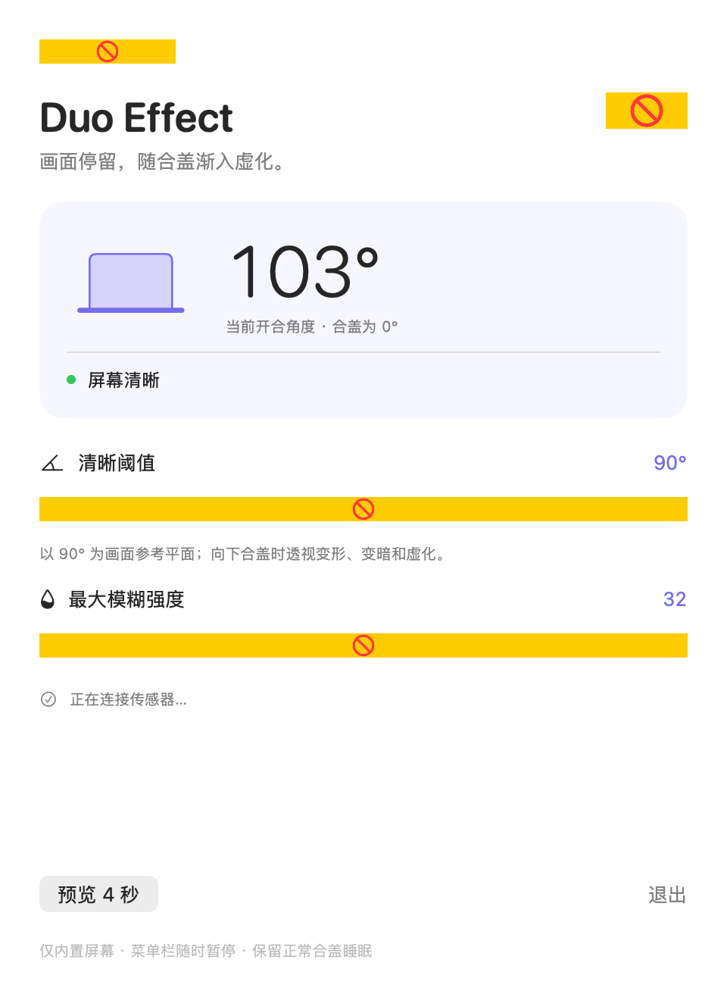

<div align="center">

# Duo Effect

**画面停留，随合盖渐入虚化。**


Duo Effect 读取 MacBook 的真实开合角度，在你合上盖子的过程中让内置屏幕的画面倾斜、变暗、虚化，并在菜单栏提供控制。

*[English](README.md)*

</div>

<hr>

- **真实开合角度：** 读取 Apple Silicon MacBook 内置的铰链传感器，效果跟随你的手实时变化。
- **实时屏幕画面：** 用 ScreenCaptureKit 捕获内置屏幕，再用 Metal 在 GPU 上以 Retina 原始分辨率、60 帧/秒重新渲染。
- **可调节：** 自己决定效果从哪个角度开始、模糊到什么程度。界面支持 English 和简体中文，可在应用内切换。
- **不打扰使用：** 点击直接穿透到下方应用，外接显示器不受影响，正常合盖睡眠保持不变。

> [!NOTE]
> 不写任何内容到磁盘，不录音，不联网。屏幕画面只在效果生效期间停留在内存里。

## 下载

目前还没有预编译的下载包，请按下方步骤自行构建；发布 Release 后会在这里附上链接。

需要 macOS 14 或更新，以及带开合角度传感器的 Apple Silicon MacBook。应用会显示传感器实时状态，是否支持一眼可知。

## 开始使用

1. 打开 **Duo Effect**。设置窗口出现，菜单栏显示实时开合角度。
2. 点击「授权屏幕录制…」，在系统设置中允许 **Duo Effect**。这是应用能模糊屏幕内容的前提。
3. 如果 macOS 要求重新打开应用，退出后再次打开即可。
4. 慢慢合上盖子。低于「清晰阈值」（默认 90°）后画面开始倾斜、变暗、虚化；重新打开超过阈值，画面立即恢复正常。

菜单栏图标可以暂停、退出或开启调试日志。设置自动保存。



## 构建

需要 Xcode（或 Apple Swift 工具链），以及钥匙串中的 **Apple Development** 或 **Developer ID** 签名证书。不依赖第三方软件包。

```sh
./scripts/build.sh
```

构建产物是 `dist/Duo Effect.app`，从访达打开即可。如果钥匙串里有多个签名证书，先把 `CODE_SIGN_IDENTITY` 设为证书的 SHA-1。重新构建前先退出正在运行的应用。

构建脚本故意拒绝临时（ad-hoc）签名：macOS 把屏幕录制权限绑定在签名证书上，临时签名会让你每次重新构建后都得重新授权。

测试、性能检查、调试日志和效果模型的细节见 [docs/DEVELOPMENT.zh-CN.md](docs/DEVELOPMENT.zh-CN.md)。

## 已知限制

- 只有带可读开合角度传感器的 MacBook 才能使用。已在 M1 Pro MacBook Pro 上验证；找不到传感器时应用会提示。
- 效果只作用于内置屏幕，顶部菜单栏也包含在内。
- 睡眠、锁屏，或传感器、屏幕捕获不可用时，效果会被移除。
- 受保护的视频（DRM）可能无法被系统捕获，在效果下可能显示为黑色。
- 开合角度协议未经 Apple 公开文档化，未来的 macOS 版本可能导致失效。
- 这是视觉效果，不是隐私屏，也不是安全屏障。

## 致谢

- [LidAngleSensor](https://github.com/samhenrigold/LidAngleSensor)：开合角度传感器协议信息。
- Apple [ScreenCaptureKit](https://developer.apple.com/documentation/screencapturekit)：本地屏幕捕获。

本项目在 AI 辅助下完成。代码为独立实现，未引入任何外部代码或软件包。

## 许可证

[MIT](LICENSE)。应用未启用沙盒：除屏幕录制授权外，它以当前用户身份拥有完整文件访问权限，并直接调用 IOKit——读取开合角度需要这样做。
